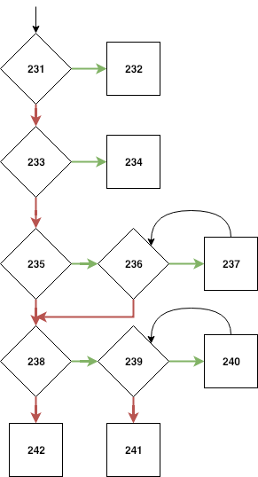
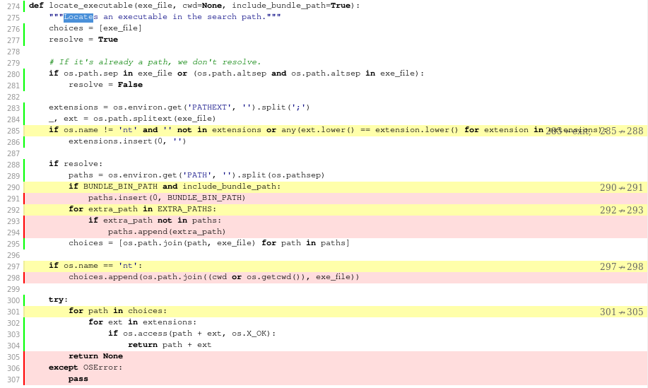

# Report for assignment 3

## Project

Name: Lektor

URL: https://github.com/lektor/lektor

Lektor is a static website generator. It builds out an entire project from
static files into many individual HTML pages and has a built-in admin UI and
minimal desktop app.

## Onboarding experience

It was easy to build and test the project. The README contains a link to an
installation guide which states what Lektor depends on and how you install it.
After installing those requirements, we could just start a virtual environment
and run pip to install all dependencies needed for testing. After doing this,
all tests passed on our systems.

Lektor seems to be a project with big room for improvement in terms of test
coverage and documentation, but there are no open issues requesting
refactoring. Thus, we will *sadly* have to pick a different project for the
next assignment.

## Complexity

Neither of us got the same results as `lizard`, and because we used slightly
different methods for computing the CC we also got different results for most
of the five functions we measured manually. One of us used the method presented
in class and the other one of us used [this
method](https://www.aivosto.com/project/help/pm-complexity.html). The
difference is that the latter does not take the number of exits and boolean
operators into account. Our results were as follows:

| Method                                             | CC lecture | CC alternative | CC Lizard |
|----------------------------------------------------|------------|----------------|-----------|
| `find_files@sourcesearch.py`                       | 5          | 4              | 5         |
| `coerce@db.py`                                     | 9          | 10             | 14        |
| `merge@utils.py`                                   | 7          | 7              | 10        |
| `content_file_info_cmd@cli.py`                     | 11         | 11             | 11        |
| `discover_relevant_flowblock_models@types/flow.py` | 8          | 9              | 10        |
| `get_image_info@imagetools.py`                     | 10         | 13             | 14        |

The functions we chose are of varying complexity. We also included the
`find_files` method to show that even though it is almost 40 lines of code,
which is longer than most of the other functions we measured, it still has a
relatively low CC. This goes to show that high CC does not necessarily imply
a long and complicated function.

Lizard seems to count every try, except and finally as one decision each. In
our interpretation of the lecture slides, every `try` statement counts as one
decision no matter how many `except`’s and `finally`’s it has. In our other method,
every `except` counts as one decision.

The documentation is very lacking in all the functions we chose. Some of them
have no documentation at all while others have a few lines explaining the
general idea of the function, but never anything about all possible outcomes.
None of them use proper docstrings. We also noted that the functions we chose
from `lektor/cli.py` are mistakenly stated to return values, which is wrong
since they only write to stdout/stderr.

### Condensation graphs
We created condensation graphs for some of the functions we chose to analyze. Here is the condensation graph we created for the function `utils.merge`



A square node represents one or more statements and a diamond node represent a condition. Green arrows is the path chosen if the condition evaluates to true and red arrows is the path chosen if the condition evaluates to false. The number in each node represents the line number of which the statement/condition occurs in the original code.

see [graphs](graphs/) for all condensation graphs.

## Function purposes

### Purpose and reason for high complexity

* `lektor.utils.merge` **CC=10**:
Merge two lists/dictionary values together.

  Complexity of this function is high because, branching is happening based on
datatype of input parameters and merge is recursive function, so based on the
input the merge function complexity changes. Merge function is handling lists
and dictionary data types and that makes the complexity high because branching
is required to handle both data types.

* `lektor.metaformat.tokenize` **CC=15**:
Tokenizes an iterable of newlines as bytes into key value pairs out of the
lektor bulk format. By default it will process all fields, but optionally it
can skip values of uninteresting keys and will instead yield `None`. This will
not perform any other processing on the data other than decoding and basic
tokenizing.

  Tokenize function has branching based on the inputs i.e iterable, encoding and
keys. So based on different values of encoding and keys branching occurs which
makes the function complex. Tokenize also makes function calls to
`_line_is_dashes` and `_process_buf` while executing which increases the
complexity. This high complexity is required so that tokenize function can
handle different type of data with filtering

* `lektor.utils.decode_flat_data` **CC=10**:
Decodes data from an iterator given from parsing a .ini file into a dictionary
of the given dictionary type, or a regular dictionary if no argument is given.

  This function is already divided into a few inner functions. It still has a
high CC, and it seems like it would be hard to decrease it further without a major refactoring.

* `lektor.utils.prune_file_and_folder` **CC=9**:
Takes a “name” filepath and a “base” filepath, where the latter is supposed to
be a parent directory of the former. The method then repeatedly tries deleting
the file or folder at the “name” filepath while walking higher up in the
hierarchy until it fails, either because it reaches the “base” filepath or a
non-empty subdirectory of the “base” filepath.

  The complexity should be lower since it could quite easily be divided into
several functions.


* `lektor.cli.content_file_info_cmd` **CC=11**:
CLI command for printing out information about Lektor project files.

  This is yet another function that is doing too many things. It essentially has four disconnected steps that can easily be factored out. There is both a refactor plan, and an actual refactor of it, so there is little value in writing more about it here.

* `lektor.imagetools.get_image_info` **CC=14**:
Utility command for parsing header info in `png`, `jpg`, `svg` and `gif` images. More specifically, given a file descriptor, it returns filetype, height and width if the image is supported. For unsupported file formats, it just returns `(None, None, None`).

  This function really has no business being this complex (CC=14). It is entirely dominated both in terms of line count and CC by parsing the `JPEG` header info, which can just as easily be put into its own function. This is one of the functions that we chose to refactor, and with little effort we broke it into three functions with CCs if 3, 5 and 8.

* `lektor.utils.get_structure_hash` **CC=14**:
Given a Python structure, this generates a md5 hash. The method maps python structures to bytes which the md5 gets updated with and later digested. Not all Python types are supported, but quite a few are.

  This function essentially calls another function `_hash` defined inside it doing all the work. In fact, `get_structure_hash` has a CC of 1 but all it does is call `_hash` and return whatever it returns. If the inside function was included, `utils.get_structure_hash` has a high CC of 14, which is plausible since `_hash` contains 10 if statements and 3 loops. This means a lot of decision making and branching. This function is as complex as it needs to be. Refactoring would be unviable since it consists of lots of if statements doing atomic work.


* `lektor.utils.locate_executable` **CC=20**:
Searches and returns the first found path to an executable file. Takes the name of the executable file to search for and current working directory.

  The function's purpose sounds simple enough but there are some factors involved in deciding where to look for that executable and what extensions to use, for example whether the given parameter is a name of an executable or a path. These come with some decision making and looping, which increase the complexity and make it the most complex function in the project. This function is way more complex than it needs to be. The actual locating isn't that complex but the part that leads to the searching is. Therefore that part of the function could be split into seperate functions, hence decreasing the overall complexity.

* `lektor.db.coerce` **CC=14**:
Takes two parameters _a_ and _b_ and coerces them to be comparable. Comparable
in this case means having the same type or one of them being `None`. For example
if a is an `int` and b is a `float`, this method makes b an `int`.

  This function is probably as complex as it needs to be. It attempts to coerce two values such that they are comparable, which necessarily involves handling a lot of cases. Further, it's a specialist function that doesn't try to do anything else. Maybe there's a cooler way of doing it.

* `lektor.types.flow.discover_relevant_flowblock_models` **CC=10**:
First some terminology. A flow is just a bunch of flowblocks. It's not important to know exactly what a flowblock is, but they are basically a set of properties with a unifying name. The function will try to find and return every flowblock given a list of flowblock names and a target database. Or, if no names are provided, it will instead return all the flowblocks from the target database.

  This function appears just a little too complex for its purpose for two reasons. One, querying for all the flowblocks instead of a subset results in a completely separate branch from a normal query, resulting in some minimal code duplication. Two, the special case handling of nested flowblocks alone results in an increased CC of 4, but this is a trivially separable function.

### Outcomes resulting in different branches

* `lektor.utils.merge`:
Merges two lists/dictionary values together.
Based on parameters and their datatype the branching occurs,
if parameter 1 is none then parameter 2 is the output and vice-versa.
For lists merging happens in a different branch and for dictionary merging
happens in another branch

* `lektor.metaformat.tokenize`:
tokenizes an iterable of newlines as bytes into key value
pairs out of the lektor bulk format.
In this function, initial branching occurs based on encoding value, if encoding
is None then the input is not decoded.
After that based on the key value the branching occurs, if key is has some
value, based on that filtering is done on iterable data and filtered data is
provided as output.

* `lektor.utils.decode_flat_data`:
A for each loop runs for every entry in the given iterator over tuples of keys
and values. Then the method attempts to split the key into parts (this is
performed in an inner function); if this does not work, the funciton skips to
the next iteration. Otherwise, the function iterates over each of these key
parts separately where the container is converted. Finally, the container is
converted into a dictionary of the type specified as an parameter to the
function.

* `lektor.utils.prune_file_and_folder`:
If the name is considered unsafe with the given base, then the method
immediately returns False. Otherwise, it continues by attempting to delete the
given name as a file. If this fails, it attempts to remove the directory
instead. Should this fail, the method fails and returns False. If it does not,
the method will split up the name to get the path and the topmost folder of that
path. If the topmost folder of that path is empty, the split is repeated. Then
the while loop runs as long as the name of the topmost folder is not empty,
attempting to delete its parent folder. This continues until an unsafe folder is
encountered based on the given base directory path, in which case the method
returns false, or until a directory cannot be deleted, for example because it is
not empty. In the later case, the function breaks out of the while-loop and
returns True.

* `lektor.cli.content_file_info_cmd`
This is a CLI command that prints out information about Lektor content files. It
operates in four distinct steps:

1. Define a `fail` function that prints an error message and then causes a
   system exit.
2. Extract the related Lektor project.
    - If any file is not related to a Lektor project, fail!
    - If any two files are related to different Lektor projects, fail!
    - If no project is found (i.e. there were no files at all), fail!
3. Extract actual content files. For every file, if it is a content file, add it
to a list.
4. Print non-error results for all of the content files found in step 3.

All of the printing (including the `fail` function's error messages) can also be
formatted as json if the `as_json` variable is set.

* `lektor.imagetools.get_image_info`
This function tries to extract filetype, width and height from an image file. It
starts by reading 32 bytes from the header, and returns early if the header is
too short. Then there is another early return if it finds that the file is
either an `SVG` or `XML` file, which is delegated to a separate function called
`get_svg_info`. The rest of the function handles `PNG`, `GIF` and `JPEG` with
one branch each, and has a catch-all that just causes all return values to be
set to none at the end. `PNG` and `GIF` are fairly trivial to parse, but `JPEG`
contains a whole lot of branching for different types of header information. The
function will also raise if the `JPEG` is malformed or uses the unsupported
`DNL` (define number of lines) header. Finally, the image `JPEG` is checked for
rotation, which (if true) causes the width and height values to be swapped with
each other.

* `lektor.utils.get_structure_hash`:
Given a Python structure this function generates a hash. Each different python
structure has its own branch where the hash is updated accordingly and thus
affect the outcome. It supports 10 different python structures. The default
branch is taken when given a python structure that is not supported, which will
return an empty hash

* `lektor.utils.locate_executable`:
This function tries to locate the path to an executable. The actual searching is
the default branch since it is always executed. However, before the searching,
the function finds the valid paths and extensions to use in the searching. What
places to look for depends on varying things, such as whether the parameter is a
file name or a path and what os is used. Appending relevant paths results in the
many branches of the function (CC=20). Basically, using different places to look
for an executable will affect the outcome of the function.

* `lektor.db.coerce`:
If the arguments are of the same type, they are already comparable and therefore
returned without modification. Any arguments that are Undefined are changed to
None. If both the arguments are strings, they are both normalized according to
the function `utils.sort_normalize_string` to standardize any string
comparisons. If either argument is a number, the function tries to convert the
other into a number of the same type. If this is not possible, eg. because of
overflow issues or because the other argument can't be interpreted as a number,
then the input is returned without modification.

* `lektor.types.flow.discover_relevant_flowblock_models`:
In the special case where no flow names are provided, the function immediately
returns all the flowblocks in the database, resulting in a terminal branch. The
other branching outcomes happen inside the processing loop, wherein each flow
name is used to query a flowblock to add to the result. The flow name is skipped
if there already is a flowblock with that name in the result, or if a flowblock
of that name doesn't exist in the database. Finally, note that flowblocks can be
nested, meaning a flowblock can contain a collection of flowblocks. If an
encountered flowblock is marked as nested, but doesn't contain any flowblocks,
then an error is raised. Otherwise, the inner flowblocks are also processed.

## Coverage

### Tools

For coverage measurements, we used the excellent
[`Coverage.py`](https://github.com/nedbat/coveragepy). It is very simple to use
and integrates well with pretty much any Python project. The documentation is
[similarly excellent](https://coverage.readthedocs.io/en/coverage-4.3.4/index.html).
To run our test suite normally, we issue the following command:

```bash
$ pytest tests
```
To run with `Coverage` (and branch coverage), it changes to this:

```bash
$ coverage run --branch --source=lektor -m pytest tests
```
The `--source=lektor` part tells `Coverage` to only trace the `lektor` package.
We were a little bit puzzled at first, because no coverage is actually emitted
by this command alone, you have to run `coverage report` afterwards to get the
results. Had we bothered to spend a couple of minutes reading the
[Quick start](https://coverage.readthedocs.io/en/v4.5.x/#quick-start), that
would not have been a problem, as it shows the correct command.

```bash
$ coverage report -m
```

The `-m` is for _missing_.  This gives a detailed report of missing statements
and branches. The somewhat annoying thing is that it does not seem to be
possible to show _only_ branch coverage. As branch coverage subsumes statement
coverage, there really is little need to show both, and the output from `report`
is fairly unreadable. There is however a way to generate a HTML report with easy
to read coverage metrics.

```bash
$ coverage html
```
The document will show the source code, and will highlight unreached statements
with red, and partially covered branching statements (i.e. one out of two
decisions made) with yellow. Everything that is fully covere lacks highlighting.

There is also a plugin for `pytest` (the test runner we use) called
[`pytest-cov`](https://github.com/pytest-dev/pytest-cov) that runs `Coverage`
automatically. It doesn't feature the most detailed output from the `report`
command (with missing statements/branches), but that information is all but
unreadable anyway. It shows coverage as a percentage and can generate the
HTML report, which is fully sufficient. Usage with `pytest-cov` looks like this:

```bash
$ pytest tests --cov lektor --cov-branch --cov-report html
```
This will generate the HTML report. Overall, it is very easy to integrate
coverage tools in a Python build environment. Part of an HTML report is shown
in the next section, when discussing our own tool.

### DYI

We decided to go one step further than hard-coding, and actually implement a
real coverage tool. It works on some of the same principles as `Coverage`,
but is much less sophisticated. It is also a bit backwards. `Coverage` reports
which branches were _not_ taken, while or tool reports which branches _were_
taken. Given that information, it is easy for a human to figure out which
branches were not taken, but it required a lot of extra effort to automate it,
and we did not have the time to. The tool currently only considers `if`, `while`
and `for` statements, and is unable to cope with condition guards that are
spread across multiple lines ([explained below](#step-2.-stack-frame-tracing)).
It does work, however, which we think is pretty cool!  We call it
`coveragetool`, and you can
[find it here](https://github.com/slarse/lektor/tree/tooling/coveragetool).
Note that it is on the `tooling` branch of the repository! Now, let's get down
to how it works. Given a set of files to measure branch coverage in, the tool
does its thing in two distinct steps, as described in the following two
sections.

#### Step 1. Analyzing the abstract syntax tree
Before any tests are run, the tool compiles all files that should be traced
into abstract syntax trees. This is easy to do in Python using the
[`ast` module](https://docs.python.org/3/library/ast.html). The tree is then
traversed, and every conditional statement (that the tool knows is a conditional,
so `if`, `while` and `for`) has its line number recorded. This functionality
is implemented in the
[`coveragetool.branchfinder`](https://github.com/slarse/lektor/blob/tooling/coveragetool/branchfinder.py)
module.

#### Step 2. Stack frame tracing
The second step is performed during code execution. In CPython, each time a
function is called, a `call` event is dispatched to a callback function (if the
callback is set). This callback is known as the global trace function. If the
global trace function decides that the `call` event is worth tracing, it returns
a local trace function callback for that scope. The local trace function is then
called for several types of events, including each time a new line is executed.
Details can be found [here](https://docs.python.org/3/library/sys.html#sys.settrace).
We essentially use this to save the previously executed line on a per-stack
frame basis. Whenever we see that the preceding line was one of the recorded
lines from [Step 1](#step-1.-analyzing-the-abstract-syntax-tree), we map the
preceding line to the current line. Here's also the reason why `coveragetool`
can't handle guards that span multiple lines: the pre-processing of the AST
doesn't actually enter the guard, it just finds the conditional statement
itself. In the same spirit, compressing several conditionals onto a single line
(such as with a ternary) will get `coveragetool` confused. `Coverage` does
something similar with tracing, too, but its tracing is implemented in C (i.e.
is _much_ faster), and it performs no pre-processing with the AST, so we have no
idea of how it figures out which branches were not taken.  That's pretty much
all there is to it, the implementation can be found in
[`coveragetool.branchtracer`](https://github.com/slarse/lektor/blob/tooling/coveragetool/branchtracer.py).

#### Actually using `coveragetool`
To actually be able to use `coveragetool`, we implemented a small local `pytest`
plugin. It can be found in
[`coveragetool.plugin`](https://github.com/slarse/lektor/blob/tooling/coveragetool/plugin.py),
and usage instructions are available in
[`tests/README.md`](https://github.com/slarse/lektor/blob/tooling/tests/README.md).

#### Comparing `coveragetool` to `Coverage`
`Coverage` is much more sophisticated than our tool, and for example has no
issues dealing with multi-line conditional guards. However, when it comes to
single-line guards for `if`, `for` and `while`, performance is remarkably
similar. Below is small part of a `Coverage` HTML report for one of the complex
functions, modified to have only single-line guards.



And here is the (somewhat truncated) output from `coveragetool`, mapping
branch statement lines to which lines where jumped to:

```
 'locate_executable@utils.py': {280: {281,
                                      283},
                                285: {286},
                                288: {289,
                                      297},
                                290: {292},
                                292: {295},
                                293: set(),
                                297: {300},
                                301: {302},
                                302: {301,
                                      303},
                                303: {302,
                                      304}},
```

The outputs correspond, but are inverted, as `coveragetool` shows covered
branches, while `Coverage` does the opposite. For example, if we look at line
292, we can see that it is highlighted yellow, and that line 293 was never
jumped to. The output from `coveragetool` shows the same thing: that from line
292, only line 295 was ever jumped to. Line 302, on the other hand, is white in
the HTML report, and `coveragetool` reports that both lines 301 and 303 were
jumped to. `coveragetool` is of course miles being `Coverage` in terms of
performance and features, but given the time we had to implement it, we are
happy with it.

### Evaluation

The old coverage report can be found in the
[report/before](https://github.com/slarse/lektor/tree/report/report/before)
directory and the new one in the
[report/after](https://github.com/slarse/lektor/tree/report/report/after)
directory. To view the reports, clone the repository and checkout to the
`report` branch. Then open one of the folders above and open the `index.html`
file found inside each of the directories above in a web browser.

Our newly added test cases can be found in the `testing` branch in the
[tests/newtests](https://github.com/slarse/lektor/tree/testing/tests/newtests)
directory.

## Refactoring

### Plans for refactoring

#### `utils.locate_executable`
[`utils.locate_executable`](https://github.com/slarse/lektor/blob/3d82277a04d2e40fdc8b7dce451c9201c5362c9c/lektor/utils.py#L274-L309)

If the name of the executable file given as a parameter is not a path the
function will enter a [section](https://github.com/slarse/lektor/blob/3d82277a04d2e40fdc8b7dce451c9201c5362c9c/lektor/utils.py#L291-L297)
that resolves this by appending paths from the os environment variable $PATH as
choices of places to look for executables. That section could be split into a
seperate function and doing so will decrease the overall CC of
`locate_executable`. Also, the [last part](https://github.com/slarse/lektor/blob/3d82277a04d2e40fdc8b7dce451c9201c5362c9c/lektor/utils.py#L302-L309)
of the function does the actual searching and before that it just listed the
valid paths and extensions to use in the searching. That last part could be
split into a seperate function that takes the paths and extensions to look for
and then return whatever that function returns.

#### `metaformat.tokenize`
[`metaformat.tokenize` (LINK)](https://github.com/slarse/lektor/blob/3d82277a04d2e40fdc8b7dce451c9201c5362c9c/lektor/metaformat.py#L18-L76)

Almost all the complexity of this function lies in the
[for-loop](https://github.com/slarse/lektor/blob/3d82277a04d2e40fdc8b7dce451c9201c5362c9c/lektor/metaformat.py#L46-L73).
However, since it relies heavily on the local variables declared at the top of
the function, refactoring this part would result in a function with a lot of
arguments. Due to this, our conclusion is that this would not improve the code
in terms of readability and that it would take a lot of work to make a clean
refactoring.

#### `utils.get_structure_hash._hash`
[`utils.get_structure_hash`](https://github.com/slarse/lektor/blob/3d82277a04d2e40fdc8b7dce451c9201c5362c9c/lektor/utils.py#L554-L582)  

This function is basically a switch statement checking what type of object the
parameter is and updating the hash accordingly. Different types of objects
updates the hash differently. Each case has a very simple body, making a
refactoring here not worth it. There is no part of the code that is reusable.
Changing a statement would alter the functionality. Generally speaking, switch
statements, or similar, are not viable for refactoring.

#### `imagetools.get_image_info`
[`get_image_info` (LINK)](https://github.com/slarse/lektor/blob/3d82277a04d2e40fdc8b7dce451c9201c5362c9c/lektor/imagetools.py#L323-L401)

First, we can note that the function essentially performs two isolated tasks:

1. Parse out the filetype ([lines 324-334](https://github.com/slarse/lektor/blob/3d82277a04d2e40fdc8b7dce451c9201c5362c9c/lektor/imagetools.py#L325-L334)).
2. Parse out the width and height (rest of the function).

Now, a part of step 1 is also an early return for SVG and XML images, which are
handled separately, so these lines would be most practical to just keep in the
top-level function. Step 2 is however so self-contained that it would be easy
to put in a separate function (called maybe, `get_image_dimensions`). A large
part of the complexity of parsing the dimensions of the images stem from
parsing JPEG header data. Not only are there many branches because of the
apparent complexity of JPEG header data, but the code is also littered with
inline comments which overshadows the rest of the functionality. An obvious
refactor step would be to simply factor out
[lines 345-397](https://github.com/slarse/lektor/blob/3d82277a04d2e40fdc8b7dce451c9201c5362c9c/lektor/imagetools.py#L345-L397)
into yet another separate function (maybe called `get_jpeg_info`). This would
reduce the line count of `get_image_dimensions` considerably, and the CC as
well. `get_jpeg_info` could then be further refactored into smaller functions,
handling different corner cases of JPEG header data.

#### `cli.content_file_info_cmd`
[`content_file_info_cmd` (LINK)](https://github.com/slarse/lektor/blob/3d82277a04d2e40fdc8b7dce451c9201c5362c9c/lektor/cli.py#L426-L479)

This function is a CLI command to print information about Lektor project files.
We can note that it performs several distinct tasks:

1. Define a `fail` function that prints an error message and then causes a
   system exit ([lines 439-443](https://github.com/slarse/lektor/blob/3d82277a04d2e40fdc8b7dce451c9201c5362c9c/lektor/cli.py#L439-L443)).
2. Extract the related Lektor project.
   ([lines 445-452](https://github.com/slarse/lektor/blob/3d82277a04d2e40fdc8b7dce451c9201c5362c9c/lektor/cli.py#L445-L455)).
    - This includes verifying that all files are related to the the same project.
3. Extract actual content files ([lines 457-464](https://github.com/slarse/lektor/blob/3d82277a04d2e40fdc8b7dce451c9201c5362c9c/lektor/cli.py#L457-L464))
4. Print non-error results ([lines 466-472](https://github.com/slarse/lektor/blob/3d82277a04d2e40fdc8b7dce451c9201c5362c9c/lektor/cli.py#L466-L479))

This is almost trivial to split into smaller parts: simply extract each of the
steps into different functions. Steps 2-3 require the `fail` function defined
in step 1, which could be provided either as a callback, or simply defining
`fail` as a standalone function. The remaining dependencies between steps
are easily resolved. Step 3 requires the project from step 2, and step 4
requires both the project from step 2 and the content files from step 3, but
that's pretty much it.

#### `db.coerce`
[`db.coerce` (LINK)](https://github.com/slarse/lektor/blob/3d82277a04d2e40fdc8b7dce451c9201c5362c9c/lektor/db.py#L110-L131)

This function is used to convert the variables to a form which allows them to
be compared. All the outer if-statements contain code for handling specific
combinations of types. The first two seem a bit small to split into separate
functions, since they almost contain no logic. [The third
if-statement](https://github.com/slarse/lektor/blob/3d82277a04d2e40fdc8b7dce451c9201c5362c9c/lektor/db.py#L115-L120)
can be split into a separate method and the last two could be placed in a
separate function. To further decrease the CC, one could replace the last `or`
statements with a function call.

### Performed refactoring

git diff ...

## Effort spent

1. plenary discussions/meetings;

2. discussions within parts of the group;

3. reading documentation;

4. configuration;

5. analyzing code/output;

6. writing documentation;

7. writing code;

8. running code?

### Kartik Kandavel
1.  Most time was spent in discussions and meetings to decide the high complexity functions
2.  4-5 hrs
3.  2-3 hrs to read the documentation
4.  30 min to 1 hr
5.  1-2 hrs
6.  Documentation consumed some good enough time (3-4 hrs maybe)
7.  3-4 hrs
8.  Barely any time (10 -15 mins) was needed for running the code

### Lars Hummelgren
1. Most of my time was spent here. We had a hard time figuring out exactly what
to do because the task is spread out among the assignment description, the
assignment grading criteria, the report template and the Canvas discussion
forum.
2. Also a lot of time, mainly for the same reason as above, but also some time
to communicate about the complexity measurements.
3. Not much, since there is very little documentation in the code.
4. Barely any time at all.
5. A few hours.
6. Approximately 5 hours. Mostly for performing the complexity measurements and
documentation of the results.
7. A few hours.
8. Not much, since the code and test cases run pretty fast. Definitely less than
one hour.

### Martin Nilsson
1. Most of the time and effort. Big part of it trying to figure what exactly
needs to be done.
2. Barely any.
3. An hour maybe to read about lektor flows.
4. None.
5. A solid day and some.
6. A few hours.
7. A few hours.
8. Barely any.

### Rouwayd Hanna
1. Many hours here. At first, we needed to put in some hours to decide project
and choose the ten functions. After that, the functions and workload had to be
delegated. Also, lots of time was spent on trying to figure out what exactly
needed to be done as the criteria was scattered  and unclear.
2. Couple of hours here. This relates to the hours put in meetings and so on.
There were parts of the assignment that needed cooperation between parts of the
group, for example manual calculation of high cc functions, that required
discussions.
3. Barely one hour. Only needed for writing the purpose part of the report.
4. None, it was easy to configure and build
5. One or two hours. Needed for identifying testing requirements and branches
that increased the complexity.
6. 4-5 hours. Most of which were spent documenting the complexity of 5 of the
functions with high CC. Also for drawing condensation graphs and analyzing the
results.
7. A few hours, mostly for testing.
8. Not much time, since the code runs fast.

### Simon Larsén
1. Many hours. The instructions were a great source of confusion, and really
need to be looked over.
2. A few hours.
3. A few hours.
4. An hour or so resolving some issues with the Lektor Travis build (some
resources the original repo used were unavailable to us).
5. Way too much time when implementing the coverage tool. But that's my own
fault for underestimating the task's difficulty by a truckload (and then some).
6. It feels like a lot of time, but I haven't kept count.
7. A lot of time, again, because the coverage tool was harder to implement than
I had estimated.
8. I have no idea.

## Overall experience
One major takeaway is that implementing coverage metrics in python is not as easy as it can seem.

Most of us take away a wider perspective on the concept of code complexity. Before this assignment, we hadn't worked much with cyclomatic complexity in particular, so obviously we have a much better sense now of what exactly "high CC" means numerically, and what a high-CC function looks like. But more generally, reasoning about CC has helped train us in better using function complexity as a heuristic for good code, rather than just, eg., the line count of the function. I have personally reconsidered a few coding conventions.

We realize also that CC can be misleading. There are a few obvious considerations. First, some functions need high-ish CC and even very bulky functions can have low CC. Second, there are various ways to artificially lower the CC, even inadvertently, without really reducing the complexity at all.

Another main takeaway for those of us not keyed into the open source scene is that even somewhat respectable repos can be internally poorly documented and slipshod.

Not all takeaways are positive, unfortunately. Most of us take away frustration with the assignment structure: there are multiple, vaguely conflicting sources of information, between the running assignment text, the assignment grading criteria, the report template, and the canvas discussion forum. We believe it would be best if there was a single, authoritative source of information, with the others merely acting as various summaries. For example, it would have been easier to plan our work if the report template merely summarized what needed to be done as described in the assignment text. As is, the report template contains novel subassignments and extra implicit work.
